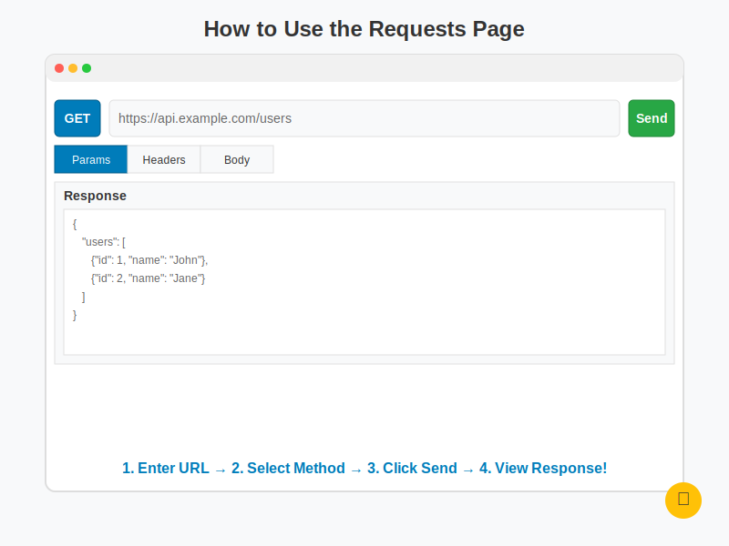
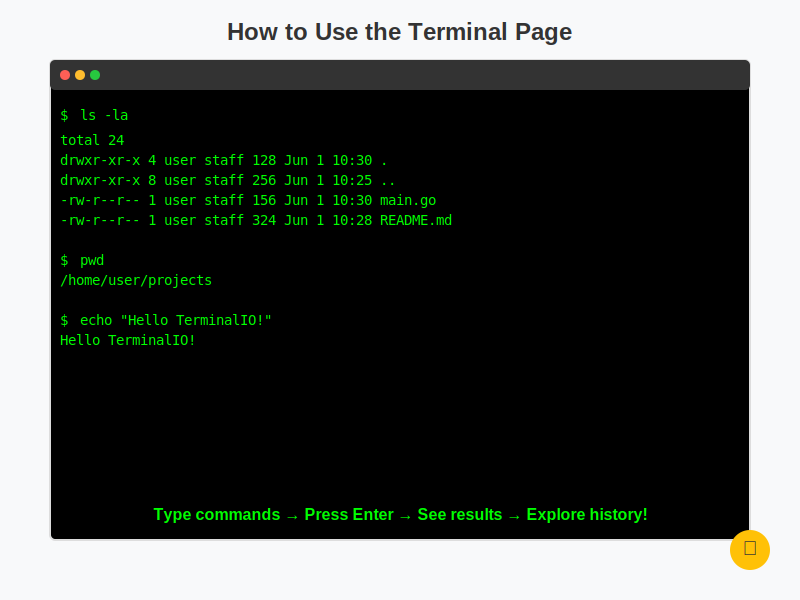

# TerminalIO


A web-based HTTP client service built with Go and the Beego framework that allows users to send HTTP requests with customizable parameters, view responses, and maintain a history of requests.

## 🖼️ Interface Overview

| Requests Page | Terminal Page |
|--------------|---------------|
|  |  |

## 🏗️ Architecture

The project has been refactored in accordance with the principles of clean architecture. A detailed description of the architecture can be found in the file [README_ARCHITECTURE.md](README_ARCHITECTURE.md).

## Features

- **HTTP Request Form**: Send requests with full parameter control:
  - URL input
  - Method selection (GET, POST, PUT, DELETE, PATCH, HEAD, OPTIONS)
  - Custom headers
  - Cookies
  - GET parameters
  - Request body
  - Timeout settings
  - Redirect and SSL options

- **Request History**: Store and manage previous requests:
  - View history of all sent requests
  - Filter by URL or method
  - Resend previous requests
  - Delete request records

- **Real-time Terminal**: Execute system commands through a web interface:
  - WebSocket-based terminal with automatic protocol detection (ws/wss)
  - Command history storage
  - Interactive command execution
  - Support for shell builtins (cd, export, etc.)


- **Database Storage**: All requests and terminal commands are stored in an SQLite database for persistence.


## 🧰 Terminal Essential Linux Tools Overview
| Tool            | Description                                      | Common Commands                                  |
|-----------------|--------------------------------------------------|--------------------------------------------------|
| `iputils-ping`  | Sends ICMP echo requests to test host reachability. | `ping google.com`<br>`ping -c 4 8.8.8.8`         |
| `curl`          | Transfers data to/from servers using HTTP, HTTPS, FTP, etc. | `curl -I https://example.com`<br>`curl https://api.github.com`<br>`curl -X POST -d '{"key":"value"}' https://httpbin.org/post` |
| `wget`          | Downloads files from the web via HTTP, HTTPS, or FTP. | `wget https://example.com/file.zip`<br>`wget --spider https://example.com`<br>`wget -O output.txt https://example.com` |

## Technologies Used

- **Backend**: Go with Beego framework
- **Frontend**: HTML/CSS with responsive design
- **Database**: SQLite
- **Real-time Communication**: WebSocket

## Getting Started

### Prerequisites

- Go 1.16 or higher
- Git

### Installation

1. Clone the repository:
   ```bash
   git clone https://github.com/Nick1994209/terminalio.git
   ```

2. Navigate to the project directory:
   ```bash
   cd terminalio
   ```

3. Run the application:
   ```bash
   go run cmd/main.go
   ```

4. Access the application in your browser at `http://localhost:8080`

### Docker

The application can also be run using Docker. Two build targets are available:

1. **Root user** (default):
   ```bash
   docker build --target root-user -t terminalio .
   docker run -p 8080:8080 --name terminalio terminalio
   ```

2. **Non-root user** (enhanced security):
   ```bash
   docker build --target non-root-user -t terminalio:nonroot .
   docker run -p 8080:8080 --name terminalio terminalio:nonroot
   ```

## Usage

1. **Main Page**: Navigate between the Requests and Terminal interfaces
2. **Requests**: Fill out the form with your desired HTTP parameters and send requests
3. **History**: View and manage your request history
4. **Terminal**: Execute system commands in real-time

## API Endpoints

- `/` - Main page
- `/requests` - HTTP request form
- `/requests/send` - Send HTTP request (POST)
- `/requests/history` - View request history
- `/requests/resend/:id` - Resend a previous request (POST)
- `/requests/delete/:id` - Delete a request from history (POST)
- `/terminal` - Terminal interface
- `/ws/terminal` - WebSocket connection for terminal (automatically uses ws:// or wss:// based on page protocol)

## License

This project is licensed under the MIT License.

---

## AI-Generated Content Notice

This project incorporates content generated with the assistance of artificial intelligence tools.
Specifically, the humorous comic dialogues in the user interface were crafted with AI assistance
to enhance user engagement and provide an entertaining experience while using TerminalIO.

The AI-generated content aims to:
- Provide helpful examples of interactions with the TerminalIO service
- Illustrate common scenarios users might encounter
- Add personality and humor to the application

While AI assistance was used in creating certain elements of this project, all code and
technical implementations were developed by human developers following best practices
in software engineering and clean architecture principles.

For more information about the architecture and design decisions, please refer to
[README_ARCHITECTURE.md](README_ARCHITECTURE.md).